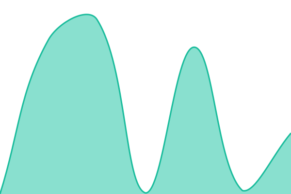
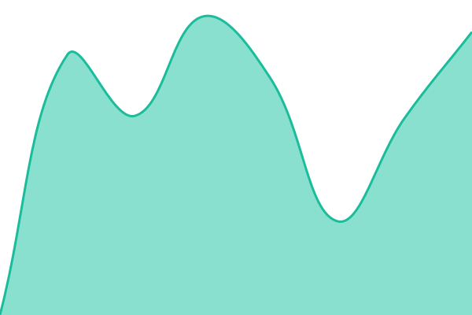
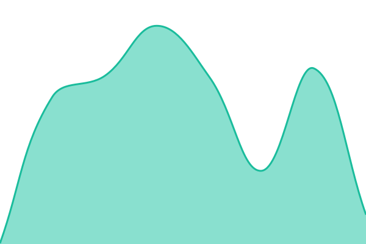
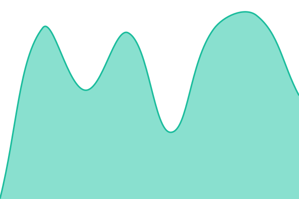
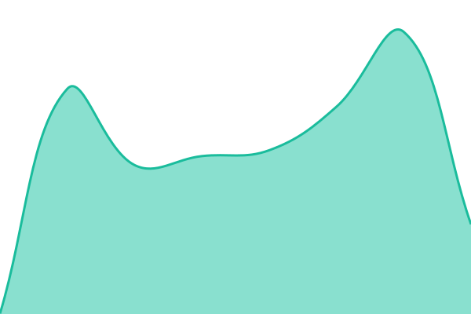
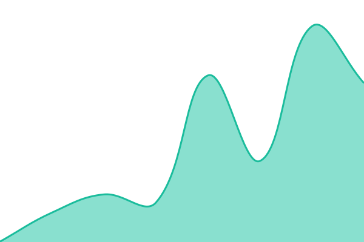

# [📈 Live Status](https://status.gomachado.com): <!--live status--> **🟩 All systems operational**

This repository contains the open-source uptime monitor and status page for [Machado](www.gomachado.com), powered by [Upptime](https://github.com/upptime/upptime).

With [Upptime](https://upptime.js.org), you can get your own unlimited and free uptime monitor and status page, powered entirely by a GitHub repository. We use [Issues](https://github.com/MachadoConsulting/Upptime/issues) as incident reports, [Actions](https://github.com/MachadoConsulting/Upptime/actions) as uptime monitors, and [Pages](https://status.gomachado.com) for the status page.

<!--start: status pages-->
<!-- This summary is generated by Upptime (https://github.com/upptime/upptime) -->
<!-- Do not edit this manually, your changes will be overwritten -->
<!-- prettier-ignore -->
| URL | Status | History | Response Time | Uptime |
| --- | ------ | ------- | ------------- | ------ |
|  [Machado Website](https://gomachado.com) | 🟩 Up | [machado-website.yml](https://github.com/MachadoConsulting/Upptime/commits/HEAD/history/machado-website.yml) | 

 2094ms
     
 | 

<a href="https://status.gomachado.com/history/machado-website">100.00%</a>
    

|  [Machado Portal](https://portal.gomachado.com) | 🟩 Up | [machado-portal.yml](https://github.com/MachadoConsulting/Upptime/commits/HEAD/history/machado-portal.yml) | 

 421ms
     
 | 

<a href="https://status.gomachado.com/history/machado-portal">100.00%</a>
    

|  [Machado Backup Vault](https://rb-machado1.rb.slc.efscloud.net) | 🟩 Up | [machado-backup-vault.yml](https://github.com/MachadoConsulting/Upptime/commits/HEAD/history/machado-backup-vault.yml) | 

 1650ms
     
 | 

<a href="https://status.gomachado.com/history/machado-backup-vault">100.00%</a>
    

|  [Machado CW Manage](https://na.myconnectwise.net) | 🟩 Up | [machado-cw-manage.yml](https://github.com/MachadoConsulting/Upptime/commits/HEAD/history/machado-cw-manage.yml) | 

 128ms
     
 | 

<a href="https://status.gomachado.com/history/machado-cw-manage">100.00%</a>
    

|  [Machado CW Automate](https://machado.hostedrmm.com) | 🟩 Up | [machado-cw-automate.yml](https://github.com/MachadoConsulting/Upptime/commits/HEAD/history/machado-cw-automate.yml) | 

 276ms
     
 | 

<a href="https://status.gomachado.com/history/machado-cw-automate">100.00%</a>
    

|  [Machado CW ScreenConnect](https://connect.gomachado.com) | 🟩 Up | [machado-cw-screen-connect.yml](https://github.com/MachadoConsulting/Upptime/commits/HEAD/history/machado-cw-screen-connect.yml) | 

 513ms
     
 | 

<a href="https://status.gomachado.com/history/machado-cw-screen-connect">99.77%</a>
    

|  [Machado Voice](https://phones.gomachado.com) | 🟩 Up | [machado-voice.yml](https://github.com/MachadoConsulting/Upptime/commits/HEAD/history/machado-voice.yml) | 

 622ms
     
 | 

<a href="https://status.gomachado.com/history/machado-voice">100.00%</a>
    

|  [DNS Filter](https://dns.gomachado.com) | 🟩 Up | [dns-filter.yml](https://github.com/MachadoConsulting/Upptime/commits/HEAD/history/dns-filter.yml) | 

 282ms
     
 | 

<a href="https://status.gomachado.com/history/dns-filter">100.00%</a>
    

|  [Hudu](https://gomachado.huducloud.com) | 🟩 Up | [hudu.yml](https://github.com/MachadoConsulting/Upptime/commits/HEAD/history/hudu.yml) | 

 301ms
     
 | 

<a href="https://status.gomachado.com/history/hudu">100.00%</a>
    

|  [Immybot](https://machado.immy.bot) | 🟩 Up | [immybot.yml](https://github.com/MachadoConsulting/Upptime/commits/HEAD/history/immybot.yml) | 

 304ms
     
 | 

<a href="https://status.gomachado.com/history/immybot">100.00%</a>
    

|  [UniFi Controller](https://hostifi.gomachado.com) | 🟩 Up | [uni-fi-controller.yml](https://github.com/MachadoConsulting/Upptime/commits/HEAD/history/uni-fi-controller.yml) | 

 464ms
     
 | 

<a href="https://status.gomachado.com/history/uni-fi-controller">100.00%</a>
    

|  [Rewst](https:/app.rewst.io) | 🟩 Up | [rewst.yml](https://github.com/MachadoConsulting/Upptime/commits/HEAD/history/rewst.yml) | 

 908ms
     
 | 

<a href="https://status.gomachado.com/history/rewst">100.00%</a>
    

|  [CIPP](https://cipp.gomachado.com/api/publicping) | 🟩 Up | [cipp.yml](https://github.com/MachadoConsulting/Upptime/commits/HEAD/history/cipp.yml) | 

 25733ms
     
 | 

<a href="https://status.gomachado.com/history/cipp">86.92%</a>
    

<!--end: status pages-->

[**Visit our status website →**](https://status.gomachado.com)

## 📄 License

- Powered by: [Upptime](https://github.com/upptime/upptime)
- Code: [MIT](./LICENSE) © [Machado](www.gomachado.com)
- Data in the `./history` directory: [Open Database License](https://opendatacommons.org/licenses/odbl/1-0/)
